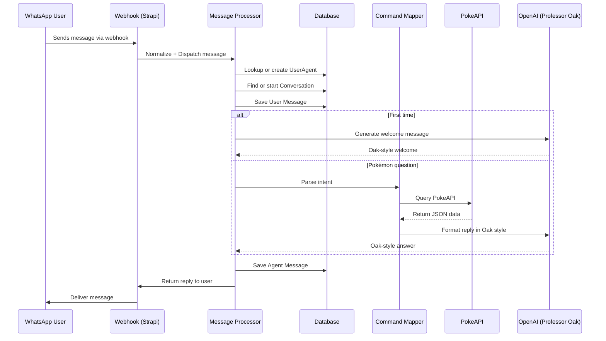

# WhatsApp AI Agent - Runtime Request Flow (Mermaid)

> This sequence diagram represents the standard message flow, from incoming WhatsApp input to AI-powered response delivery, covering both first-time and returning user logic.

