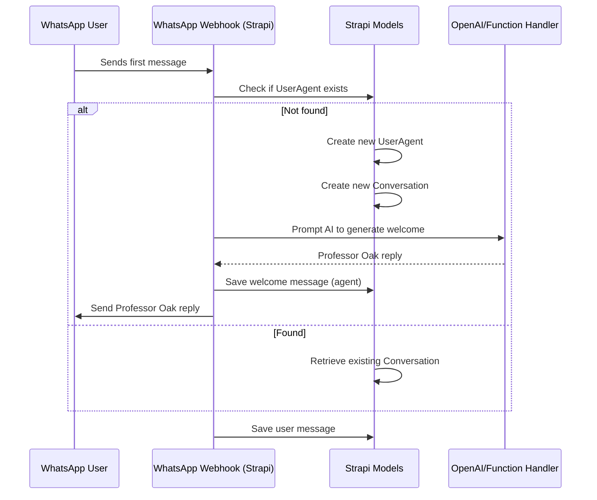
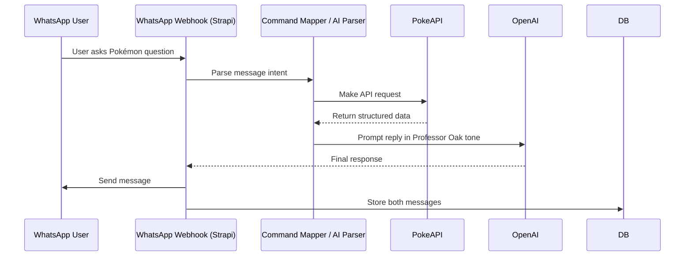

# WhatsApp AI Agent - Sequence Diagrams

### First-Time Message Processing

```mermaid
sequenceDiagram
    participant WA as WhatsApp User
    participant API as WhatsApp Webhook (Strapi)
    participant DB as Strapi Models
    participant AI as OpenAI/Function Handler

    WA->>API: Sends first message
    API->>DB: Check if UserAgent exists
    alt Not found
        DB->>DB: Create new UserAgent
        DB->>DB: Create new Conversation
        API->>AI: Prompt AI to generate welcome
        AI-->>API: Professor Oak reply
        API->>DB: Save welcome message (agent)
        API->>WA: Send Professor Oak reply
    else Found
        DB->>DB: Retrieve existing Conversation
    end
    API->>DB: Save user message
```

### Pokémon Question Answering

```mermaid
sequenceDiagram
    participant WA as WhatsApp User
    participant API as WhatsApp Webhook (Strapi)
    participant NLP as Command Mapper / AI Parser
    participant PokeAPI as PokeAPI
    participant AI as OpenAI

    WA->>API: User asks Pokémon question
    API->>NLP: Parse message intent
    NLP->>PokeAPI: Make API request
    PokeAPI-->>NLP: Return structured data
    NLP->>AI: Prompt reply in Professor Oak tone
    AI-->>API: Final response
    API->>WA: Send message
    API->>DB: Store both messages
```

